# Introduction

{width=50%}

**Tauray 2.0** is a GPU-accelerated rendering software developed at Tampere
University. Its focus is on speed and scalability. Tauray can be used for
generating datasets as well as developing real-time rendering algorithms.
It is primarily used as a command-line program, which makes scripting and
remote use over SSH easy.

This file is the end-user manual; it does not describe how to develop new
features for tauray. See [`DEVELOPERS.md`](DEVELOPERS.md) for details on how to
work with Tauray source code.

This document may not always be perfectly up-to-date. You can get the most
up-to-date information on all available options through `tauray --help`. That
information is gathered in such a way that the developers cannot accidentally
miss updating it when they add new options or modify old ones.

In any case, you should [install Tauray](#installing-tauray) and
[prepare a scene](#scene-setup) first. Then, you should check that the scene
works properly, using the [interactive mode](#interactive-rendering) or a
one-off [offline rendering](#offline-rendering). After that, you should
[read how Tauray is configured](#configuration) and
[choose the options](#options) based on your needs, and render the final
results.

# Installing Tauray

It is recommended that you run Tauray on a PC running Ubuntu 22.04 LTS with one
or more Nvidia RTX GPUs.

## Building Tauray

Tauray has some dependencies, so install them first:

```bash
sudo apt install libvulkan-dev vulkan-validationlayers vulkan-tools imagemagick libnng-dev \
    libcbor-dev libczmq-dev libglm-dev libsdl2-dev
```

Then, you can build Tauray.

```bash
cmake -S . -B build
cmake --build build
```

You can use Tauray from `build/tauray` (make sure to run it like this, it won't
find its internal `data` folder if you do `./tauray` in the build folder!), or
you can install it system-wide with

```bash
sudo cmake --install build
```

The rest of the manual assumes a system-wide installation.

# Scene setup

*If you want to skip this part, you can just use the included test model
`test/test.glb`* instead of the `example.glb` shown in example commands.

Tauray only supports glTF 2.0 files as inputs. They must be in the `.glb` binary
format. These files can contain almost everything needed, such as the geometry,
cameras, lights and even animations.

There are some features missing in glTF 2.0. To work around these limitations,
Tauray comes with a Blender plugin. Usage of this plugin is not required, but
recommended, as some scene features will not work properly without it. We will
be going over how to install this plugin, author a scene in Blender, and export
it for Tauray.

## Blender setup

While not the only possible option, [Blender](https://www.blender.org/) is a
great open-source 3D authoring tool that we recommend for preparing scenes for
Tauray. Start by installing the newest version, if you don't yet have it.

Next, we'll install the Tauray plugin. First, navigate to the Tauray folder and
find the `blender` folder. Make a .zip file of the `tr_gltf_extension` file
included within (unless it already exists).

Now, you can open Blender. Go to the preferences and open the "Add-ons" section.

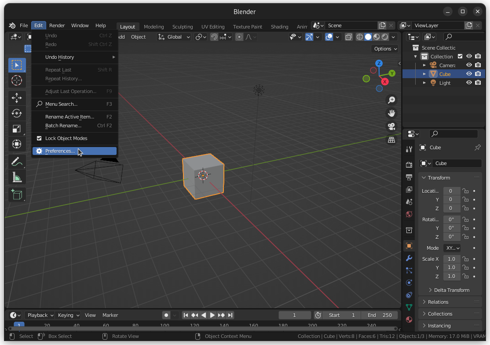

Next, press the "Install" button.

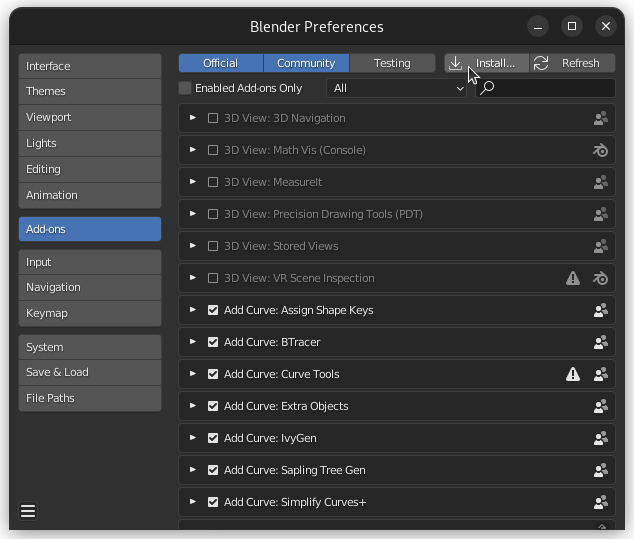

From the file dialog that opens, navigate to the Tauray folder. Go to the
`blender` directory and find the .zip you just created. Then, click the
`Install Add-on` button.

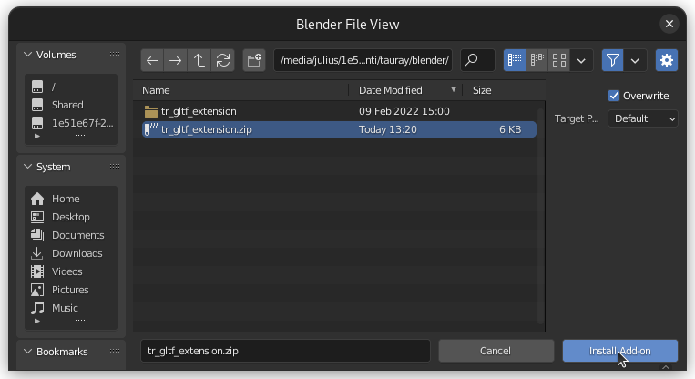

Depending on Blender version and whether you already had the plugin installed,
it may be automatically shown in the Add-ons section. If not, search for
"tauray". In any case, enable the "Tauray glTF extension" by checking the
checkbox next to the name.

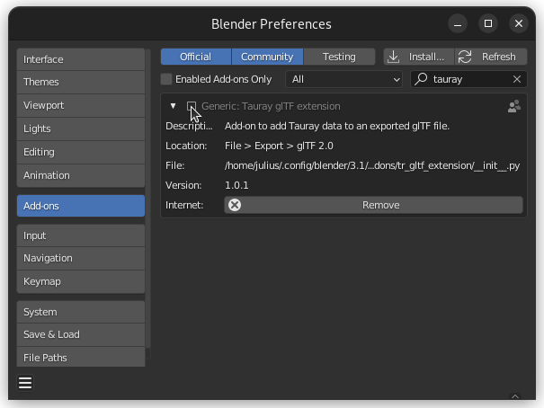

You only need to install and enable the addon once, Blender will remember it
across projects. You can now close the preferences window and start working with
the scene.

## Scene preparation

This is not really the proper place for a full Blender modeling tutorial.
If you need to make models yourself, you can use any tutorial you find, but
please only use the "Principled BSDF" material. Also, make sure that the scene
has a light source! Otherwise, you won't see anything. Setting up a camera is
also important, otherwise you may only get a poorly placed default camera.

You can find high-quality ready-made models with good free licenses from
[Poly Haven](https://polyhaven.com/models),
[some Sketchfab collections](https://sketchfab.com/nebulousflynn/collections/cc0),
and [danish museum scans](https://www.myminifactory.com/users/SMK%20-%20Statens%20Museum%20for%20Kunst).
You can import some of these in Blender, move them around, add a camera and a
light, then export.

Reusing random models found online in the `.blend` format is often problematic
as they tend to use complicated Blender-specific material nodes and features;
it's best to import general-purpose models instead.

Tauray supports rigid and skeletal animations. Morph targets are not supported,
so scenes relying on those will not work properly. You should also ensure that
all meshes are triangulated, especially if they use normal maps.

## Exporting from Blender

Once you've designed a suitable scene, it's time to export it from Blender.
From the File dropdown, select the Export > glTF 2.0 option.

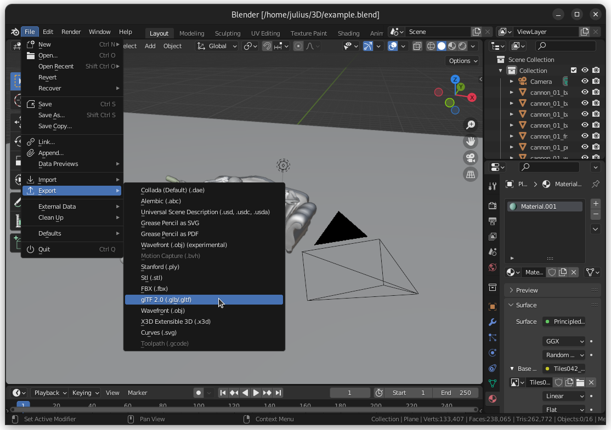

Now, export the model with the settings shown in the image below. You must enable
exporting tangents if your scene uses normal maps (and they don't harm you in
any case), and cameras and punctual lights. Additionally, lighting mode must
be "Unitless" for now.

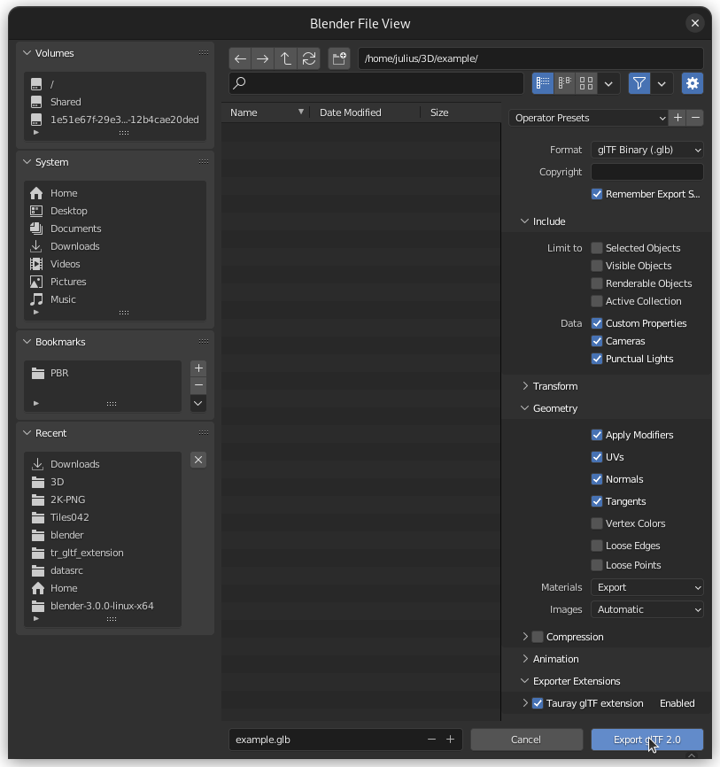

You can now click the "Export glTF 2.0" button. We are now done with Blender
for the extent of this manual.

# Interactive rendering

The interactive mode allows you to fly around in your scene in real-time.
It is the default mode in Tauray, so you don't have to set any extra parameters
to use it!

```bash
tauray /path/to/example.glb
```

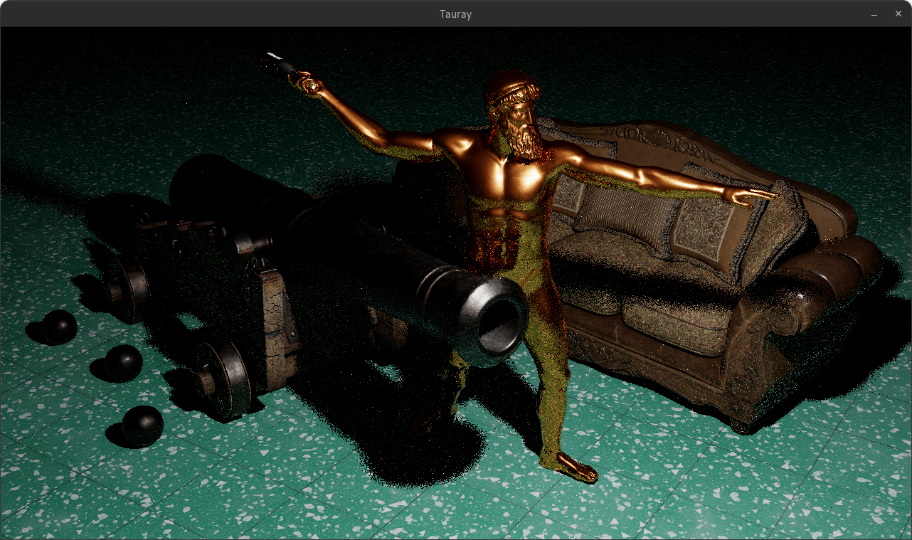

Tauray does not have a loading screen, so large scenes will simply show a black
screen until it's done loading.

You can fly around with typical FPS controls. For this reason, Tauray will also
grab your cursor while running. The controls are summarized below.

Table: Controls of Tauray's interactive mode.


| Control     | Function                  |
|:------------|---------------------------|
| Escape      | Close the program         |
| W           | Fly forwards              |
| S           | Fly backwards             |
| A           | Fly to the left           |
| D           | Fly to the right          |
| Left shift  | Descend                   |
| Space       | Ascend                    |
| Mouse move  | Turn camera               |
| Scroll up   | Speed up flight           |
| Scroll down | Slow down flight          |
| Page up     | Switch to next camera     |
| Page down   | Switch to previous camera |
| 0           | Reset camera to origin    |
| F1          | Detach cursor from window |
| F5          | Reload all shaders        |
| T           | Print timing info         |
| Return      | Pause all animations      |

You may want to start experimenting with different options now. They are outlined
in the [Options](#options) chapter. Certain (but very few) options are specific
to the interactive mode. They are mostly related to windowing.

# Offline rendering

Offline rendering means that instead of an interactive session, you want to
leave the computer rendering high-quality images over a long time, ranging from
seconds to days. This is what you want to do when you wish to generate datasets,
for example.

Offline rendering can be done with the headless mode. This mode does not open a
window and doesn't even require a desktop session to exist - it's very suitable
for running on a server.

This command will render the same example image as in interactive mode, but as
a still image.

```bash
tauray /path/to/example.glb --filetype=png --headless=output
```

You may want to start experimenting with different options now. They are outlined
in the [Options](#options) chapter. Certain (but very few) options are specific
to the headless mode. They are mostly related to the output format and
animations.

# Configuration

Configuration of Tauray can be done in a three ways: command-line parameters,
configuration files and the command-line interface.

The command-line parameters you've already seen earlier in this document:
`--filetype=png` is one of these. In general, most command-line parameters
start with `--` and have an equals-sign for specifying the value. There's also
no whitespace. Then there's also the short flags: `-f`, enables fullscreen mode,
for example.

Configuration files have all of the same parameters available, but they use a
slightly different syntax. Preceding dashes are omitted, and the equals sign
is optional. Whitespace is allowed! Short flags also do not exist in
configuration files, so you'll need to use their long names instead (e.g.
`fullscreen` instead of `f`). An example configuration file could look as follows:

```bash
# Let's call this file my_config.cfg
# This is a comment!
film blackman-harris
force-double-sided on
max-ray-depth 5
accumulation on
renderer path-tracer
sampler sobol-z3
samples-per-pixel 1
regularization 0.2

# Config files are also allowed to load each other like this, but please avoid
# creating cycles.
config base_config.cfg
```

If you saved this file as `my_config.cfg`, you can load it in Tauray using the
`--config=my_config.cfg` parameter.

Finally, there's the command-line interface (CLI). It is only available in
interactive mode. You can access it by detaching control of the Tauray window
with F1 and alt-tabbing to the console/terminal where you launched Tauray. Now,
you can type in commands with the same syntax as in the configuration files,
but they will take place while the program is running!

You can use the CLI to experiment with options without having to restart Tauray
constantly. There's also some extra features in the CLI that are not present
elsewhere: you can get help for one specific command with the `help command-name`
command, close the program with `quit` and print current configuration with
`dump`.

A few parameters cannot be changed while the program is running; generally,
these are related to windowing or how the scene is loaded. You cannot switch
into headless mode, re-select involved GPUs, change display type, etc. without
restarting Tauray.

# Options

Tauray has a __lot__ of options and most things are customizable. Here, we've
gathered the most important ones with example images of their function where
applicable. Remember that you can always get the most up-to-date information
with `tauray --help`.

In general, options are documented with a list of possible values for them.
For example, `--some-algorithm-selection=<algo-a|algo-b|algo-c>` means that
`--some-algorithm-selection=algo-b` would select the `algo-b` option of the
listed three. Boolean flags (`--some-boolean-flag=<on|off>`) also have a short
form: You can simply use `--some-boolean-flag` to set the value to `on`.

While everything here is documented with the command-line parameter syntax (with
the `--`, etc.), these options are also usable in configuration files. Just drop
the `--` and replace the equals-sign with a space.

## Presets

`--preset=<preset-name>` loads the given preset.
"Presets" are configuration files that are shipped with Tauray (in
`data/presets/preset-name.cfg`) and can be loaded with a shorthand name.

+-------------------------------+----------------------------------------------------------------------------------------+
| Preset                        | Image                                                                                  |
+:=============================:+:======================================================================================:+
| `accumulation`: Interactive   |                                                     |
| renderer that slowly reduces  |                                                                                        |
| noise when not moving.        |                                                                                        |
+-------------------------------+----------------------------------------------------------------------------------------+
| `ddish-gi`: Interactive       | 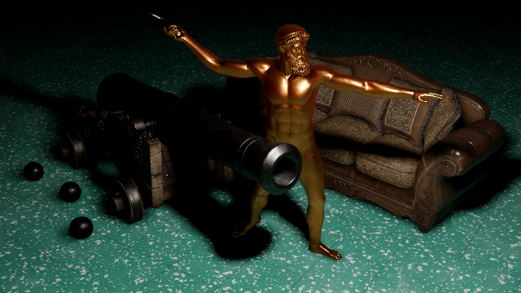                                                        |
| rendering with a fast global  |                                                                                        |
| illumination approximation.   |                                                                                        |
+-------------------------------+----------------------------------------------------------------------------------------+
| `denoised`: Interactive       | 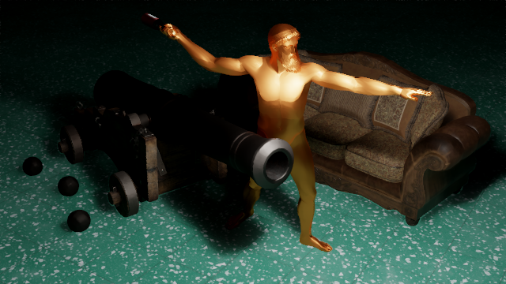                                                        |
| renderer that produces        |                                                                                        |
| denoised images.              |                                                                                        |
+-------------------------------+----------------------------------------------------------------------------------------+
| `direct`: Interactive         | 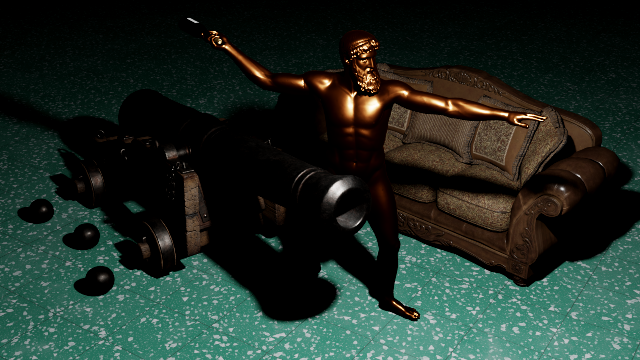                                                          |
| renderer that computes        |                                                                                        |
| direct light references.      |                                                                                        |
+-------------------------------+----------------------------------------------------------------------------------------+
| `quality`: Offline renderer   | 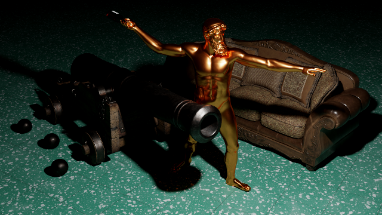                                                         |
| that creates high-quality     |                                                                                        |
| images fairly quickly.        |                                                                                        |
+-------------------------------+----------------------------------------------------------------------------------------+
| `reference`: Reference        | 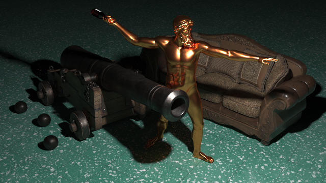                                                       |
| renderer that avoids biased   |                                                                                        |
| images.                       |                                                                                        |
+-------------------------------+----------------------------------------------------------------------------------------+
| `restir-hybrid`: Hybrid       | 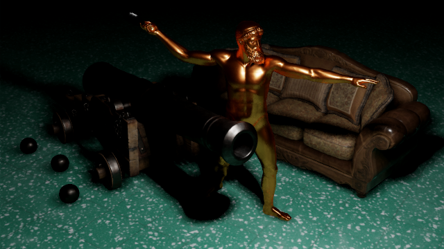                                                   |
| renderer between ddish-gi     |                                                                                        |
| and restir.                   |                                                                                        |
+-------------------------------+----------------------------------------------------------------------------------------+

Presets are subject to minor changes every now and then, so don't rely on
specific behaviour (except for the `reference` preset).

## Fullscreen

`-f` or `--fullscreen=<on|off>` enable fullscreen mode.
Runs the interactive Tauray session in fullscreen at the native resolution. By
default, Tauray runs in a window instead.

## Output resolution

`-h=<integer>` and `--height=<integer>` set the output height,
`-w=<integer>` and `--width=<integer>` set the output width,
The default output size is 1280x720. The output size is the window size in
interactive mode and the output image file size in offline rendering.

## Replay mode

`-r` or `--replay=<on|off>` enable the replay mode. This means that even in
the interactive mode, the user does not have camera control. Instead, it follows
the animation, if present. This option is also forced on by the headless
rendering mode.

## Silent

`--silent` disables all printing except errors and timing data (if the latter is
requested).

## Timing

`-t` or `--timing=<on|off>` make Tauray print timing information on every frame.
If you are benchmarking Tauray performance, please only use this with interactive
mode. If you need to use headless mode regardless, ensure that its output
filetype is `none`, so that your benchmark doesn't end up just measuring your
disk speed instead.

By default, Tauray uses its own timing format, as presented below:

```
FRAME 617:
	DEVICE 0:
		[skinning] 0.001856 ms
		[scene update] 0.051872 ms
		[light BLAS update] 0.026624 ms
		[path tracing (1 viewports)] 1.55018 ms
		[distribution frame from host] 0.283552 ms
		[stitch (1 viewports)] 0.047136 ms
		[tonemap (1 viewports)] 0.032608 ms
	DEVICE 1:
		[skinning] 0.001568 ms
		[scene update] 0.050688 ms
		[light BLAS update] 0.02576 ms
		[path tracing (1 viewports)] 1.1321 ms
		[distribution frame to host] 1.26109 ms
	HOST: 3.64286 ms
```

Additionally, you can change the timing output format into "Trace Event Format"
with `--trace=trace-event-format`. The output can be viewed in Chrome's
`about://tracing`. This is particularly useful with
`--timing-output=<filename>`, which forwards output to another file.

You get the frame index (the first frame is `FRAME 0`) and timing for each
rendering stage on every device. The `HOST` timing means the overall frametime
as measured on the CPU: this is what you want to use for benchmarks, excluding
the first and last few values which wind the in-flight frames up and down.

You can also press the `T` key while Tauray is running to print the same timing
info for one frame only.

## Vertical synchronization

`-s` or `--vsync=<on|off>` can be used to enable vertical synchronization. This
is only meaningful in interactive mode and is used to combat display tearing
artifacts occurring in motion:

| 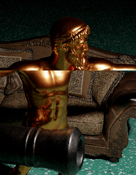{width=50%}  | 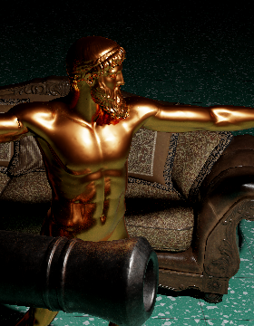{width=50%} |
|:--------------------------------------------:|:--------------------------------------------:|
| Tearing with `--vsync=off`.                  | No tearing with `--vsync=on`                 |

These artifacts are not any Tauray-specific issue, they occur in any program
that doesn't do vertical synchronization. It's caused by the image being only
partially updated when the display is refreshing.

*Important!* Do not benchmark Tauray with vertical sync enabled! It
intentionally limits the framerate!

## Throttle

`--throttle=<framerate>`

can be used to force Tauray's framerate to be below the given rate, in
interactive modes. This is useful for debugging issues that are hard to see at
high framerates, and can help conserve battery life when running on a laptop.

## Validation

`--validation=<on|off>` sets whether Vulkan validation layers are enabled or
not. They're good for debugging and reporting issues, but bad when benchmarking.
Most presets explicitly disable validation for performance reasons.

## Progress bar

`-p` can be used to display an ASCII progress bar, which estimates how long
the rendering is going to take at the current rate. It is only available in
conjunction with `--headless`.

## Renderer

`--renderer=<renderer-name>` sets the renderer used by Tauray. Tauray comes with
many different renderers. Below is a table of each, with example images. The
default renderer is the path tracer.

Table: Summary of renderers included in Tauray.

+-------------------------------+----------------------------------------------------------------------------------------+
| Renderer                      | Image                                                                                  |
+:=============================:+:======================================================================================:+
| `path-tracer`: Photorealistic | 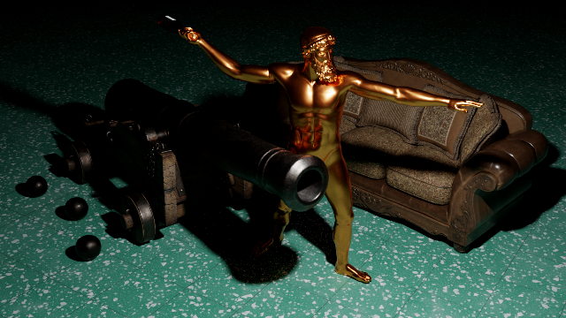                                                            |
| algorithm susceptible to      |                                                                                        |
| noise.                        |                                                                                        |
+-------------------------------+----------------------------------------------------------------------------------------+
| `direct`: Ray traced          |                                                                  |
| direct light only.            |                                                                                        |
+-------------------------------+----------------------------------------------------------------------------------------+
| `raster`: Naive rasterization | 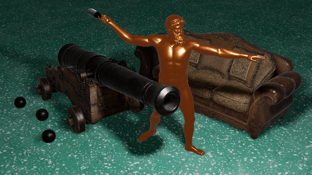                                                                 |
| with shadow mapping.          |                                                                                        |
+-------------------------------+----------------------------------------------------------------------------------------+
| `dshgi`: DDISH-GI.            | 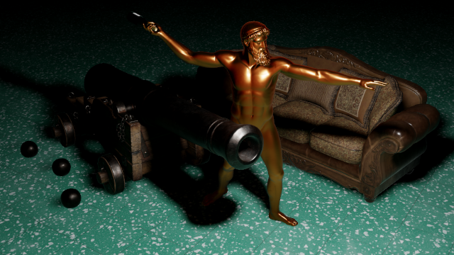                                                                  |
+-------------------------------+----------------------------------------------------------------------------------------+
| `restir`: ReSTIR DI/PT        |                                                                  |
| for real-time rendering.      |                                                                                        |
+-------------------------------+----------------------------------------------------------------------------------------+
| `restir-hybrid`: ReSTIR       | 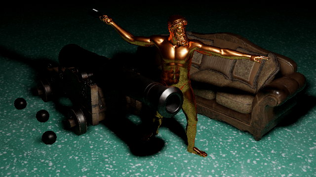                                                          |
| hybridized with DDISH-GI.     |                                                                                        |
+-------------------------------+----------------------------------------------------------------------------------------+
| `albedo`: Albedo of the first | 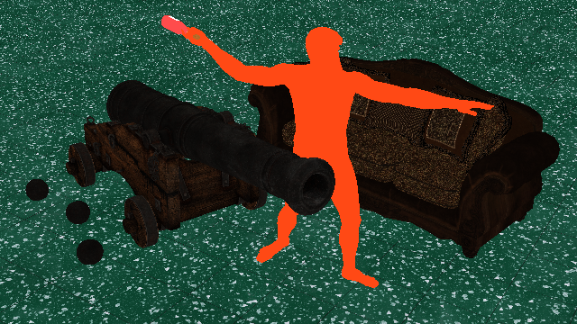                                                                 |
| intersection.                 |                                                                                        |
+-------------------------------+----------------------------------------------------------------------------------------+
| `world-normal`: World-space   | 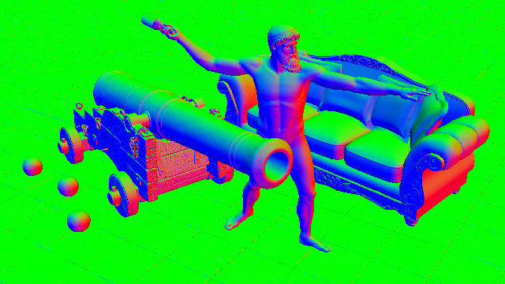                                                           |
| of the first intersection.    |                                                                                        |
+-------------------------------+----------------------------------------------------------------------------------------+
| `view-normal`: View-space     | 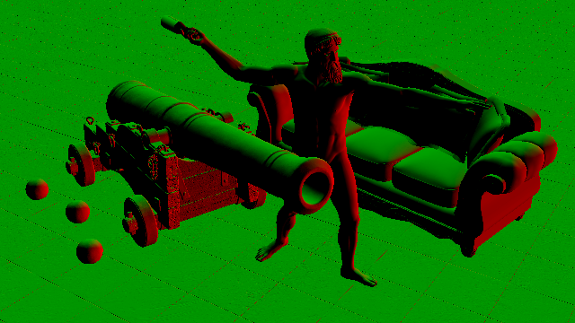                                                            |
| normal of the first           |                                                                                        |
| intersection.                 |                                                                                        |
+-------------------------------+----------------------------------------------------------------------------------------+
| `world-pos`: World-space      | 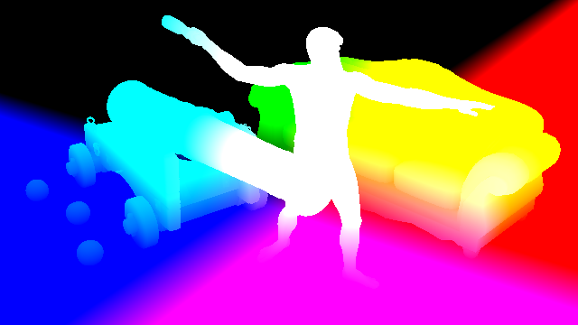                                                              |
| position of the first         |                                                                                        |
| intersection.                 |                                                                                        |
+-------------------------------+----------------------------------------------------------------------------------------+
| `view-pos`: View-space        | 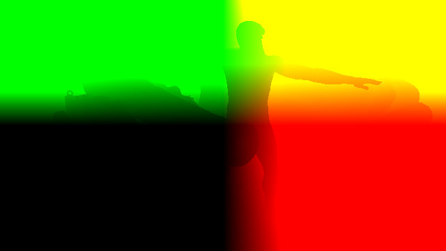                                                               |
| position of the first         |                                                                                        |
| intersection.                 |                                                                                        |
+-------------------------------+----------------------------------------------------------------------------------------+
| `distance`: Distance to the   | 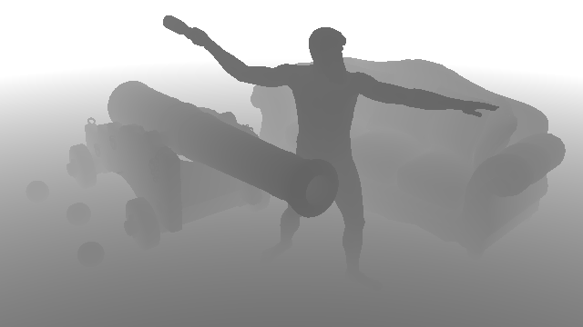                                                               |
| first intersection.           |                                                                                        |
+-------------------------------+----------------------------------------------------------------------------------------+
| `world-motion`: World-space   | 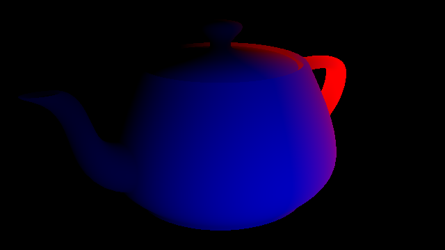                                                           |
| movement between frames.      |                                                                                        |
+-------------------------------+----------------------------------------------------------------------------------------+
| `view-motion`: View-space     | 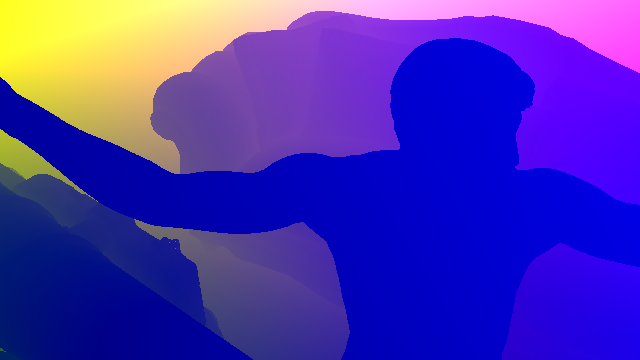                                                            |
| movement between frames.      |                                                                                        |
+-------------------------------+----------------------------------------------------------------------------------------+
| `screen-motion`: Screen       | 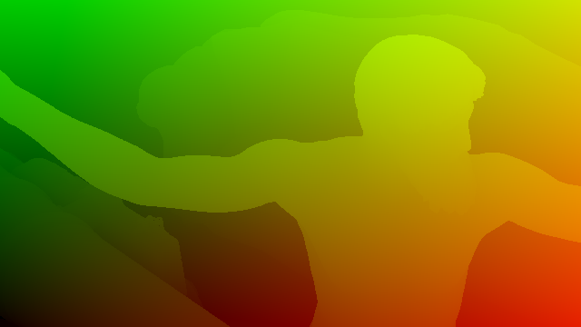                                                          |
| coordinate of intersection    |                                                                                        |
| in previous frame.            |                                                                                        |
+-------------------------------+----------------------------------------------------------------------------------------+
| `instance-id`: Color channels | 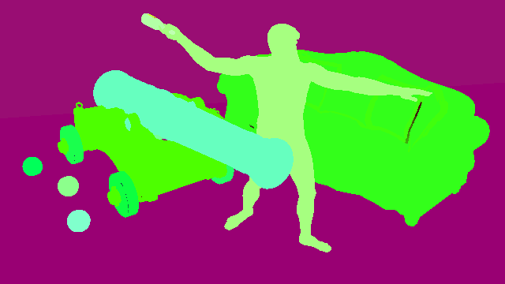                                                            |
| are geometry-dependent IDs.   |                                                                                        |
+-------------------------------+----------------------------------------------------------------------------------------+

### Primary renderers

These are the `path-tracer`, `restir`, `raster` and `dshgi` renderers.
Many further options only affect some of these renderers.

There's two that you'll most likely be interested in. `restir` is an
implementation of the state-of-the-art ReSTIR DI/GI/PT algorithms, and has very
low noise levels (by real-time rendering standards). These methods are unbiased
by default.

For offline rendering or simpler real-time rendering needs, you'll want to be
running `path-tracer`, which is just a very normal forward path tracer with
MIS, NEE and BSDF importance sampling.

If you can't run Tauray normally due to missing ray tracing support, you may
still be able to run the `raster` renderer. But in that case, there's hardly any
reason to be running Tauray, anyway...

`dshgi` is the underlying renderer for DDISH-GI. Note that when creating scenes
for DDISH-GI (`dshgi`), you should place an "Irradiance Volume" that covers
the scene in Blender. DDISH-GI will use this volume for its probe placement.
The resolution selected in Blender for the irradiance volume will also be used
by Tauray.

### ReSTIR DI / GI / PT

The ReSTIR implementation in Tauray is extremely configurable, to the point that
all three big variants can be achieved with simple configuration variables. See
["A Gentle Introduction to ReSTIR](https://intro-to-restir.cwyman.org/) to learn
further details of what these parameters do.

The implementation acts as ReSTIR DI if `--max-ray-depth=2`, otherwise it's PT.
The special `restir-hybrid` renderer is similar to ReSTIR GI. It only does one
bounce, after which lighting is gathered from DDISH-GI probes and punctual
lights. Direct explicit lighting uses shadow maps also, as this helps with
performance and isn't always noticeable if PCSS is configured properly.

`--restir.max-confidence=<int>` sets the maximum confidence of a reservoir.
Large values have generally lower noise, but increase correlation between temporal
frames. The default is 16, and you probably shouldn't go any higher. While
even large confidences don't technically cause bias over time, overconfidence
can backfire via large correlated areas:

| 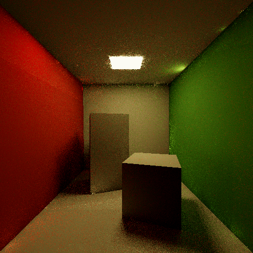 |
|:-------------------------------------------------------------------------------------------------:|
| Too high confidence can cause VPL or MLT-like artefacts, depending on the selected shift mapping. |

`--restir.temporal-reuse=<on|off>` is on by default. It enables the temporal
feedback loop, which makes ReSTIR do its party trick, the explosively increasing
sample quality. It's also the cause of temporal correlation, and is generally
harmful if you want to accumulate and converge an image.

`--restir.canonical-samples=<int>` sets the number of canonical samples, e.g.
number of new samples injected into the feedback loop per frame. It's somewhat
similar to SPP in a path tracer. Higher numbers = less noise but the performance
cost is linear.

`--restir.spatial-samples=<int>` sets the amount of neighbors considered for
spatial reuse. 0 disables spatial reuse. The default is 2, which is quite low
for ReSTIR literature, but it's pretty good for real-time still.

`--restir.passes=<int>` defaults to one. It's the number of successive spatial
reuse passes per frame. It can help good samples cover a large distance even
without temporal reuse.

`--restir.sample-spatial-disk=<on|off>` selects how the spatial neighbors are
searched. It's enabled by default, and searches from a surface-aligned disk. If
disabled, the search area is a screen-space disk.

`--restir.shift-mapping-type=<reconnection-shift|random-replay-shift|hybrid-shift>`
defaults to `reconnection-shift`.

`reconnection-shift` is the fastest and works quite well in scenes with fairly
high roughnesses, but performs no better than a regular path tracer with
mirror-like surfaces.

`random-replay-shift` is a general method that produces higher noise levels and
is the slowest, but kind of deals with any light transport issues. Its
weaknesses are somewhat similar to Kelemen-style MLT.

`hybrid-shift` aims to combine the good noise level and performance of
`reconnection-shift` and robustness `random-replay-shift`. It's generally good,
and just a bit slower than `reconnection-shift` (depending on scene). There's
a scene-dependent parameter though, `--restir.reconnection-scale=<float>`, which
controls the minimum ray length considered for reconnection. You may need to
adjust it if you see artifacting in concave corners.

`--restir.max-search-radius=<float>` controls the maximum distance for spatial
neighbor search. `--restir.min-search-radius=<float>` controls the minimum
distance (this should be non-zero to avoid sampling the original pixel itself).

By default, the implementation is unbiased and all `assume-*` are off. You can
enable specific biases / assumptions for increased performance.

`--restir.assume-unchanged-material=<on|off>` assumes that the material has not
changed between frames in temporal reuse, saving some bandwidth in material
storage and reading.

`--restir.assume-unchanged-acceleration-structure=<on|off>` assumes that
geometry in the acceleration structures has not changed between frames. If there
are moving objects in the scene, this introduces brightening and darkening bias
near them.

`--restir.assume-unchanged-reconnection-radiance=<on|off>` lets the temporal
reuse assume that radiance incoming to the reconnection vertex has not changed.
This saves re-tracing the rest of the path in temporal reuse, and helps quite a
bit with performance. Of course, it biases with movement or lighting changes.

`--restir.assume-unchanged-temporal-visibility=<on|off>` lets the temporal reuse
assume that reconnection will not be blocked when shifting previous samples to
the new frame. Again, this breaks with movement and sometimes also with rounding
errors from the selection of the previous pixel.


### Feature buffer / AOV renderers

These are the `albedo`, `world-normal`, `view-normal`, `world-pos`, `view-pos`,
`distance`, `world-motion`, `view-motion`, `screen-motion`, and `instance-id`
renderers. They all use a common backend, which is why most options affecting
feature buffers tend to affect all of them equally.

In the table above, many color channels appear black or extremely bright. This
is because the PNG files cannot preserve the entire range of values. Feature
buffers are internally rendered to floating-point buffers, so you probably don't
want to be using `.png` files for feature buffer datasets.

Instead, use `.exr`, which preserves negative and values larger than 1. `.exr`
is the default image type in Tauray so that you wouldn't accidentally lose data
if you forgot to specify the filetype.

Particularly, the `instance-id` renderer places the instance ID in the red color
channel, triangle index in the green color channel, and mesh index in the blue
color channel. They are all integers, so `.png` will not suffice!

## Alpha to transmittance

`--alpha-to-transmittance=<on|off>`

A crude approximation that turns alpha + albedo color into colored transmittance
for all materials in the scene whose constant alpha factor is below 1.0.
It is disabled by default. You can use this to get transmittance with some .glb
files that have not been exported with Tauray's Blender plugin.

| 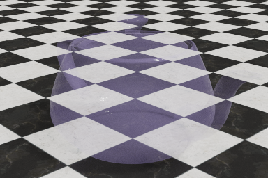 | 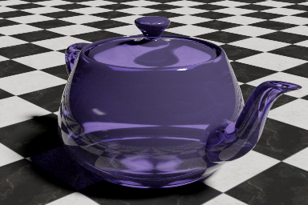    |
|:--------------------------------------------------------------:|:---------------------------------------------------------------:|
| A scene with an alpha blended teapot.                          | The same scene with `--alpha-to-transmittance`.                 |

`--transmittance-to-alpha=<number>` is simply the inverse operation, but it has
very few use cases. The value is the minimum alpha assigned to materials
converted this way.

## Ambient

`--ambient=<r,g,b>`

The `raster` renderer does not properly estimate surrounding
indirect lighting. Instead, it applies a constant light, called "ambient light",
to every surface in the scene. You can adjust that ambient light's color and
intensity with this parameter.

| 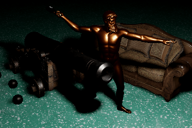  | 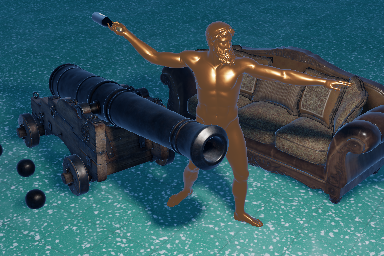 |
|:----------------------------------------------------------:|:-----------------------------------------------------------:|
| `raster` rendering with `--ambient=0,0,0`.                 | The same scene with `--ambient=0.1,0.2,0.4`.                |

Setting ambient to zero is equivalent to simulating direct light only. Note that
this parameter does nothing in the `dshgi` or `path-tracer` renderers, as
they don't use an ambient light.

## Animation

`--animation` or `--animation=<name>`

Tauray supports animations, but they are not running by default. You can add the
`--animation` flag to play animations. Without a string parameter, the flag just
plays the first found animation for everything in the scene. If you give a
string, it tries to play animations with that name.

Both rigid and skeletal animations are supported. The camera and lights can be
animated as well. Note that camera animation will not work in interactive mode,
because the camera is controlled by the user instead. If you want to preview an
animation, you can use the `-r` flag (replay mode) to forego user control of the
camera.

By default, `headless` mode (offline rendering) will render all frames of the
full animation with this flag specified. You can limit the number of frames to
something lower with `--frames=<integer>`.

If your animation render is interrupted without finishing, you can easily
continue from the frame you left off with `--skip-frames=<integer>`. Also, you
can skip all rendering entirely with `--skip-render`. That way, you can save
camera logs without having to actually render or save images.

In replay and offline rendering modes, you can set the simulated framerate for
the animation with `--framerate=<number>`. It defaults to 60 fps.

## Aspect ratio

`--aspect-ratio=<number>`

By default, Tauray assumes that pixels are square. If you want them to be
something else, you can force the image aspect ratio with `--aspect-ratio`.

|  | 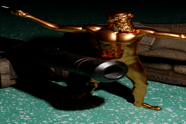     |
|:--------------------------------------------------------:|:--------------------------------------------------------:|
| The default aspect ratio, which is 1.5 in this case.     | The same scene with `--aspect-ratio=0.75`.               |

## Camera

There's many ways to modify the camera included in a scene with command line
options, because it's often faster to compare different views this way instead
of re-exporting the scene with a different camera from Blender.

### Camera selection

`--camera=<name>`

If there are multiple cameras in the scene, you can choose which one to use
by specifying `--camera=nameofthecamera`. The default camera is the first one.

### Camera position

`--camera-offset=<x,y,z>`

You can also move the camera a bit from its original position with
`--camera-offset=<x,y,z>`.

### Camera projection

`--force-projection=<perspective|orthographic|equirectangular>`

It's possible to force a different camera projection than specified in the
scene. Note that the `equirectangular` projection only works with ray tracing!

Table: Summary of available camera projections.

| Projection        | Image                                                           |
|:-----------------:|:---------------------------------------------------------------:|
| `perspective`     | 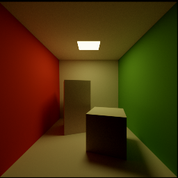{height=6cm}         |
| `orthographic`    | 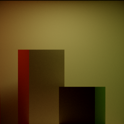{height=6cm}             |
| `equirectangular` | 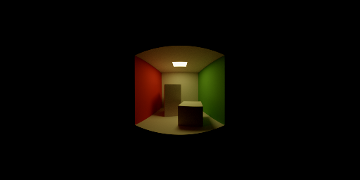{height=6cm} |

### Camera clip range

`--camera-clip-range=<near,far>`

This parameter forces specific near and far planes for the camera. Things
outside of that depth range will be clipped/culled in rasterization-based
renderers.

### Field of view (FOV)

`--fov=<number>`

If you want to force a different field of view than the original, you can do so
with `--fov`. Adjusting FOV is just like adjusting zoom on a camera.
Lower FOV = more zoomed in.

| 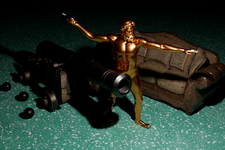{width=50%} | 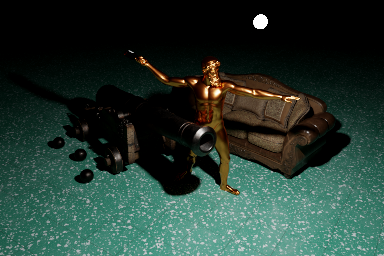{width=50%}  |
|:---------------------------------------:|:----------------------------------------:|
| `--fov=30`                              | `--fov=40`                               |

### Camera grid / simple light fields

`--camera-grid=<w,h,x,y>`

`--camera-grid-roll=<degrees>`

`--camera-recentering-distance=<distance>`

If you want to render a grid of views instead of just one, you can easily turn
one camera into many with the `--camera-grid` option. It takes four numbers:
`w` and `h` specify the view grid size horizontally and vertically; `x` and `y`
specify the distance between views horizontally and vertically. If you want the
grid to be rotated (without rotating the cameras themselves!), you can use
`--camera-grid-roll=<degrees>`.

`--camera-recentering-distance` is used to set the distance to the zero-disparity
plane. In other words, objects at that depth appear at the exact same screen
coordinates on all cameras of the grid. This parameter is commonly needed for
VR and light field setups.

### Camera logging

`--camera-log=<path-to-log>`

You can write a log of camera matrices from an animation using this flag. The
data will be in the JSON format.

## Networking

There are certain setups in Tauray that require networking. There's always a
server and a client. The server will bind to a port (default is 3333, you can
set it with `--port=<integer>`. The client will connect to a server with an
address that can be specified with `--connect=<address:port>` (default is
localhost:3333).

## Default value

`--default-value=<number>`

You can set the default value to be used in feature renderers when the ray
misses geometry. The default is NaN, which can be stored and detected in .exr
images.

| 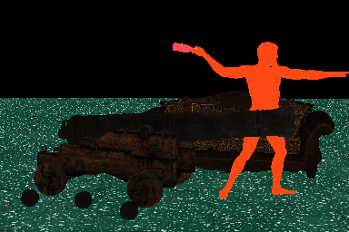   | 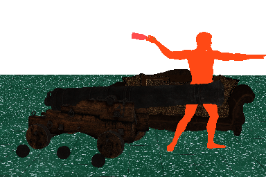     |
|:---------------------------------------------:|:---------------------------------------------:|
| An `albedo` render, with `--default-value=0`. | The same scene, with `--default-value=1`.     |

## Denoising

`--denoiser=<none|svgf|bmfr>`

Denoising can be used with the `path-tracer` renderer in order to reduce noise
from the images. You basically only want this when very few samples per pixel
are taken, which causes massive noise.

While the SVGF denoiser somewhat corresponds to the
"Spatiotemporal Variance Guided Filtering" paper, it has been upgraded quite a
bit, and is pretty close to state-of-the-art in real-time denoising.

| 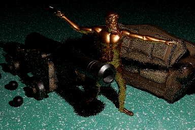       | 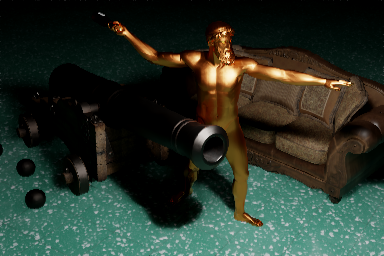     |
|:-----------------------------------------------:|:-----------------------------------------------:|
| A path traced rendering with `--denoiser=none`. | The same scene, with `--denoiser=svgf`.         |

You may want to use `--warmup-frames=<number>` for offline rendering use cases
in order to get some temporal history before starting actual rendering. Doing
so will reduce noise. Usually, you also use denoising in conjunction with
[temporal anti aliasing](#temporal-anti-aliasing).

### SVGF parameters

`--svgf=<atrous-diff-iter,atrous-spec-iter,atrous-kernel-radius,sigma-l,sigma-z,sigma-n,min-alpha-color,min-alpha-moments>`

This sets the parameters for the SVGF denoiser. Note that the defaults are quite
general, and it's unlikely that you'll gain much by changing these parameters.
`atrous-diffuse-iter` sets number of iterations of the A-Trous filter for the
diffuse contribution, while `atrous-spec-iter` sets them for the specular
contribution. `atrous-kernel-radius` sets the A-Trous filter size.
`sigma-l` controls the luminance weight, `sigma-z` controls the depth weight, and
`sigma-n` controls the normal weight. `min-alpha-color` controls the temporal
accumulation speed for color data, and `min-alpha-moments` controls the
accumulation speed for moments used to drive the variance guidance.

## Multi-device rendering

`--devices=<int,int,...>`

You can define which devices to use with the `--devices` argument. By default,
it uses all ray tracing-capable GPUs that are found. If you only want one GPU,
you can use `--devices=-1` (which picks the default GPU) or `--devices=0` (which
picks the first one) and so on. You can also give a list of integers to define
a subset of GPUs to use.

If only have one GPU, but want to debug multi-GPU stuff, yuo can use the
`--fake-devices=<N>` option, which creates N logical devices for each physical
device.

### Distribution strategy

`--distribution-strategy=<duplicate|scanline|shuffled-strips>` determines
how the rendering workload is distributed to multiple GPUs. `duplicate` does
all calculations on each GPU and is not useful. `scanline` distributes scanlines
evenly across all GPUs, and is a good choice when the GPUs are identical.
`shuffled-strips` is the default, as it dynamically adjusts to uneven GPU
performance.

### Workload distribution

With the `shuffled-strips` strategy, Tauray distributes the rendering workload
dynamically based on how long each GPU took to render earlier frames. To set
the initial distribution (e.g. for single-frame offline rendering), you can use
`--workload=<gpu1-share,gpu2-share,...>` to set the ratio of workload given to
each GPU.

## Display

`--display=<headless|window|openxr|looking-glass|frame-server|frame-client>`

Display type. If you use `--headless`, the `headless` display is forced on.
Otherwise, you can pick whether you want to output to a window, to a VR HMD with
OpenXR or a Looking Glass light field display. `frame-server` and `frame-client`
are special, see [frame streaming](#frame-streaming).

### Looking Glass

`--lkg-params=<viewports,midplane,depthiness,relative_view_distance>`

You can set the parameters for rendering to a Looking Glass display with the
`--lkg-params` option. `viewports` is the number of discrete viewports to
render, this would usually be between 48 to 128. `midplane` is the plane of
convergence, i.e. which scene depth corresponds to the actual physical distance
of the display from the viewer's eye. `depthiness` can be used to adjust the
distance between viewports, and `relative_view_distance` is the distance of the
user's eye relative to the size of the display (this is needed for the Y axis,
as the Looking Glass displays only have multiple horizontal views.)

Additionally, if your Looking Glass isn't connected via USB to the computer
running Tauray, you can still use it. In that case, you'll need to use the
`--lkg-calibration=<...>` parameter. Read further instructions from
`tauray --help`.

### Frame streaming

Tauray supports a really simple form of frame streaming. This can be used to
have an interactive session on a render farm, although you really should run
it at a very low [resolution](#output-resolution), because the frames are
sent uncompressed!

You need two instances of Tauray for this. They can, and probably should be,
on different computers. One of them acts as the server and is given the flag
`--display=frame-server`, while the other is the client, which is given
`--display=frame-client`.

The frame server does the entire rendering, while the frame-client sends its
inputs over to the server and receives frames from the server. You can set the
port for the server with `--port=<port-number>`, and the client can then specify
the address via `--connect=url:port`.

## Environment map

`--envmap=<path-to-envmap>`

Environment maps are among one of the only things that glTF 2.0 files cannot
contain. If you want your scene to have a "background image" instead of floating
in an infinite black void, you need to specify an environment map with the
`--envmap` parameter. You can find free CC0-licensed environment maps from
[Poly Haven](https://polyhaven.com/hdris).

| 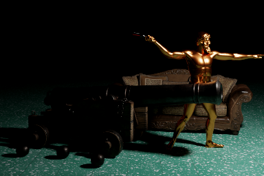  | 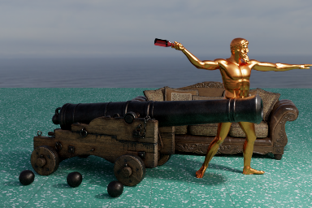   |
|:----------------------------------------:|:----------------------------------------:|
| A path traced rendering with no envmap.  | The same scene, with an environment map. |

Environment maps make it easier to generate realistic-looking images of
individual objects, as you don't have to model proper surrounding geometry.
They are also nice in larger scenes as well.

By default, environment maps are importance sampled. This has a noticeable
performance impact and you may want to disable the importance sampling sometimes.
You can do this with `--sample-envmap=off`. Note that this importance
sampling is basically required if your environment map includes the sun or any
other small and bright light source:

| 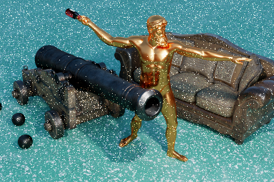{width=50%} | 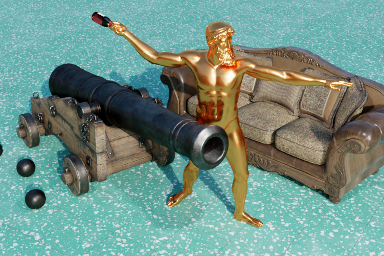{width=50%}      |
|:--------------------------------------------------:|:--------------------------------------------------:|
| `--sample-envmap=off`                   | `--sample-envmap=on` (default)          |

## Tone mapping

`--tonemap=<filmic|gamma-correction|linear|reinhard|reinhard-luminance>`

`--gamma=<number>`

`--exposure=<number>`

If you want to affect the final look of the render, you can adjust the
tonemapping parameters. Firstly, you'll want to pick a tonemapping operator with
`--tonemap`.

Table: Summary of available tonemapping operators.

+-------------------------------------+-----------------------------------------------------------------------------------+
| Operator                            | Image                                                                             |
+:===================================:+:=================================================================================:+
| `filmic`: Looks generally good, but |                                               |
| has relatively stark contrast for   |                                                                                   |
| an HDR operator.                    |                                                                                   |
+-------------------------------------+-----------------------------------------------------------------------------------+
| `gamma-correction`: Plain and       | 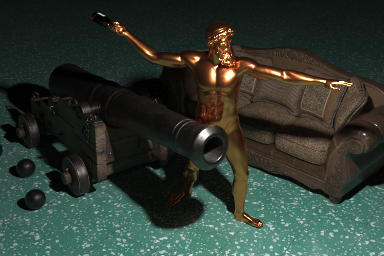                                                |
| susceptible to clipping, but        |                                                                                   |
| sometimes required for science.     |                                                                                   |
+-------------------------------------+-----------------------------------------------------------------------------------+
| `linear`: Looks wrong on regular    | 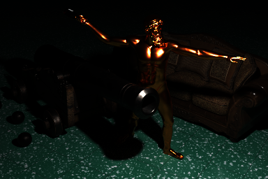                                              |
| displays, but is useful if you      |                                                                                   |
| intend to do math with the output.  |                                                                                   |
+-------------------------------------+-----------------------------------------------------------------------------------+
| `reinhard`: A bit plain, but works  | 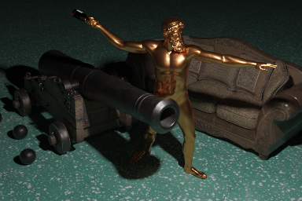                                          |
| well with HDR. Often seen in        |                                                                                   |
| literature.                         |                                                                                   |
+-------------------------------------+-----------------------------------------------------------------------------------+
| `reinhard-luminance`: Reinhard done | 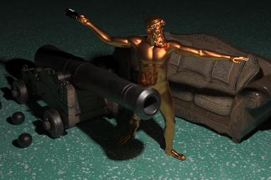                                        |
| on luminance instead of color       |                                                                                   |
| channels. Technically incorrect,    |                                                                                   |
| but preserves saturation better.    |                                                                                   |
+-------------------------------------+-----------------------------------------------------------------------------------+

Then, you can adjust `gamma`, to change the
[gamma curve](https://en.wikipedia.org/wiki/Gamma_correction).
It affects every operator except `linear`. It's usually best to leave this as
the default value 2.2 unless your display expects a different gamma value.

| 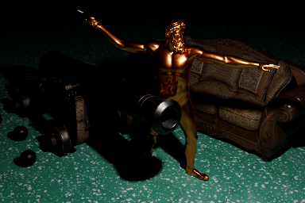{width=50%} | 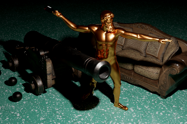{width=50%} |
|:---------------------------------------------:|:---------------------------------------------:|
| Filmic tonemapping with `--gamma=1.5`.        | The same scene, with `--gamma=2.5`.           |

`exposure` should be used to adjust the overall brightness of the image. It
works just like adjusting exposure on a real camera, although it's defined in
relative terms. `--exposure=1` is the default exposure that is expected by glTF
files. `--exposure=2` doubles the brightness _before_ tonemapping.

| 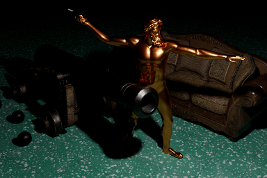  | 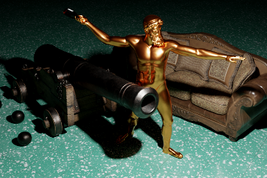    |
|:-----------------------------------------:|:-----------------------------------------:|
| Filmic tonemapping with `--exposure=0.5`. | The same scene, with `--exposure=2.0`.    |

## Output file

### File format
`--filetype=<exr|png|bmp|hdr|raw|none>`

You can change the file format for the output data of
[headless mode](#offline-rendering) with `--filetype`. The default is .EXR,
which may be hard to view without an EXR viewer application, but it will not
lose data. If you intend to generate images just to be looked at, you probably
want to specify `--filetype=png` instead. Tauray's PNG output is limited to
8-bits-per-channel color, clipped between 0 to 1.

The `raw` file format just dumps 4 floating point numbers per pixel to the disk
as-is. This can be easy to load in your own programs consuming Tauray data, as
you don't have to deal with image formats. However, you must know the size of
the image yourself, as no metadata is included.

The `none` format just means that no output is actually written. This can be
useful for benchmarking Tauray on a server, so you don't end up benchmarking
disk and EXR compression speed instead.

### Pixel format

`--format=<rgb16|rgb32|rgba16|rgba32>`

This flag sets the pixel format for EXR files. All are floating point formats,
you can only choose whether you want 3 (`rgb`) or 4 (`rgba`) color channels
and half floating point values (`16`) or regular floating point values (`32`).

### Compression

`--compression=<zip|zips|rle|piz|none>`

Currently, this parameter only sets the compression scheme for the EXR format.
All schemes are lossless, but may not be supported by every EXR viewer. For
example, a 384x256 image of the example scene used in this manual takes 594
kilobytes with `--compression=none`, and 403 kilobytes with `--compression=piz`.
The PIZ compression scheme is used by default.

## Anti-aliasing

There's many parameters controlling how anti-aliasing is done, as it's generally
a bit different between path tracing and rasterization-based methods. By
default, anti-aliasing is **disabled** because it makes it harder to
post-process images afterwards. However, if you just want to show pretty
pictures, you most definitely want to enable it.

### Rasterization

In rasterization (i.e. `raster` and `dshgi` renderers), two related
anti-aliasing methods are available:
[MSAA](https://en.wikipedia.org/wiki/Multisample_anti-aliasing) and
[SSAA](https://en.wikipedia.org/wiki/Supersampling).

Both are enabled by setting `--samples-per-pixel=<integer>`, where the integer
is a power-of-two number between 1 and 8. 1 corresponds to no anti-aliasing and
is the default, whereas 8 is the slowest and prettiest anti-aliasing.

MSAA is used by default. It only anti-aliases geometric edges, so shading
details such as sharp shadows may still appear aliased. SSAA is enabled by
setting `--sample-shading=on`. This method is very slow, as it linearly
increases the workload by your `--samples-per-pixel` value. However, it
generally works the best.

Table: Comparison between anti-aliasing methods for rasterization.

| Anti-aliasing mode | Image                                                 |
|:------------------:|:-----------------------------------------------------:|
| No anti-aliasing   | 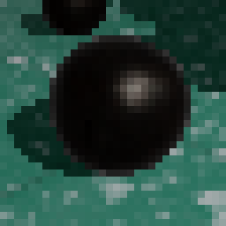{width=32%} |
| 8 x MSAA           | 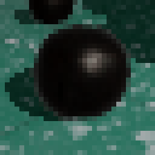{width=32%}  |
| 8 x SSAA           | 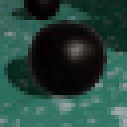{width=32%}  |

### Path tracing

`--film=<point|box|blackman-harris>`

With `path-tracer`, you can set the film filtering scheme. This jitters the
origin of the ray according to a filter function, in order to cause
anti-aliasing with a method that is fairly physically correct. You can set the
filter shape with `--film`. `box` looks like the anti-aliasing methods available
in rasterization, but `blackman-harris` has fewer artifacts and is recommended
instead. `point` is the default, which means that all rays start from the center
of the pixel and there is no anti-aliasing.

`--film-radius=<number>`

For the `box` and `blackman-harris` filters, you can set the filter radius
`--film-radius`. The default is usually good, but you can make the image
appear even less aliased (and blurrier) if needed. Higher radius = blurrier
image.

Note that the anti-aliasing starts to appear once you have multiple samples
per pixel. So you'll want to set `--samples-per-pixel` to something higher than
1.

Table: Comparison between film filters for anti-aliasing path traced images.

| Film filtering                           | Image                                               | Explanation                                                            |
|:----------------------------------------:|:---------------------------------------------------:|:----------------------------------------------------------------------:|
| `point`                                  | 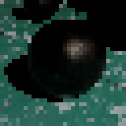                       | No anti-aliasing.                                                      |
| `box`                                    | 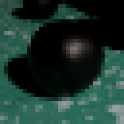                           | Anti-aliased. This case doesn't show major issues with the box filter. |
| `blackman-harris`                        |    | Less blurry than `box` but still well anti-aliased.                    |
| `blackman-harris` with `--film-radius=4` | 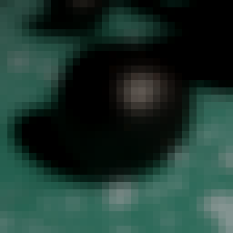 | Who smudged the lens?                                                  |

### Temporal anti-aliasing

`--taa=<sequence-length,edge-dilation,anti-shimmer>`

Tauray also implements [Temporal Anti-Aliasing](https://en.wikipedia.org/wiki/Temporal_anti-aliasing).
This works with all renderers, but isn't recommended with path tracing unless
you also use a [denoiser](#denoising). The `sequence-length` corresponds to the
equivalent SSAA sample quality that it aims for, and refers to the jittering
sequence length. `edge-dilation` is enabled by default, it helps with tracking
motion of anti-aliased edges.

TAA can cause some flickering in shiny edges. `anti-shimmer` is a hack that
aims to reduce this, but it is not enabled by default.

Table: Comparison between supersampling anti-aliasing with temporal anti-aliasing.

| Anti-aliasing mode        | Image                                     | Explanation                                           |
|:-------------------------:|:-----------------------------------------:|:-----------------------------------------------------:|
| 8 x SSAA                  |  | The aimed quality of SSAA.                            |
| 8 x TAA                   | 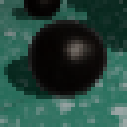   | TAA generally works well when there is little motion. |

## Sidedness

`--force-double-sided=<on|off>`

`--force-single-sided=<on|off>`

Usually, Tauray follows what each glTF 2.0 material has specified as the
"sidedness" of the surface. Many models are marked as single-sided, simply
because that is faster in rasterization-based methods. However, this is not
true in ray tracing, where double-sided surfaces are faster. The options
`--force-double-sided` and `--force-single-sided` can be used to force the
desired kind of sidedness.

Single-sided surfaces are also known as **Backface culling**.

| 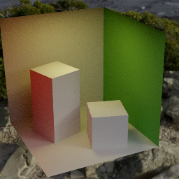 | 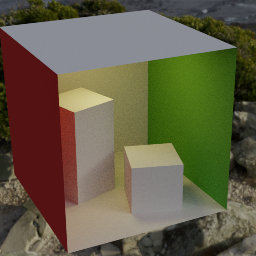 |
|:------------------------------------------------------:|:------------------------------------------------------:|
| Cornell box with the original single-sided behaviour.  | The same scene with `--force-double-sided`             |

*If you want to improve ray tracing performance, use `--force-double-sided`!*

## Pre-transformed vertices

`--pre-transform-vertices=<on|off>` is yet another performance option. Enabling
it consumes more memory, but is likely faster in multi-bounce path tracing
due to only calculating vertex transforms once instead of on each bounce on
every pixel.

## HDR

`--hdr=<on|off>`

If you have an HDR display, you can make use of it with `--hdr`. You probably
want to use a tonemapping that doesn't target values between 0 to 1, so you
probably should simply use `--tonemap=gamma-correction`. *note*: VR HMDs
usually specify HDR support and you want to enable this with them!

## Hide lights

`--hide-lights=<on|off>`

In path tracing, light sources are also rendered. For example, a spherical light
will appear as a bright sphere. You can disable this from primary rays with
`--hide-lights`.

| {width=50%}  | 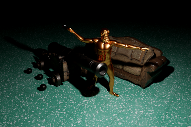{width=50%} |
|:----------------------------------------------------:|:-----------------------------------------------------------:|
| Note how the light source is visible.                | With `--hide-lights`, it's hidden!                          |

## Firefly mitigation (path space regularization & indirect clamping)

`--regularization=<number>`
`--indirect-clamping=<number>`

If your image suffers from fireflies, you have two ways to get rid of them:
path space regularization with `--regularization` and indirect clamping with
`--indirect-clamping`.

Path space regularization is the recommended way to do this. It biases the image
by strategically adjusting roughness for indirect bounces such that fireflies
cannot occur. Good values for real-time renders are between 0.1-0.5. Higher
values make caustics appear blurrier.

Indirect clamping is the older but powerful way to reduce or remove firelies.
However, it's a fairly aggressive method that causes more biasing and loss of
energy than path space regularization. Usually, good indirect clamping values
are around 10-100, lower values start to affect the image too much.

|                | 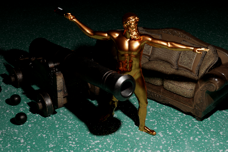    | 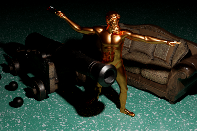 |
|:------------------------------------------------:|:------------------------------------------------:|:------------------------------------------------:|
| Fireflies can be seen in the cannon's shadow.    | The same scene with `--indirect-clamping=5`.     | The same scene with `--regularization=0.5`.      |

## Ray bounces

`--max-ray-depth=<integer>`

This parameter sets the maximum number of edges in a path, in ray tracers. The
number of bounces is one less. Higher numbers are generally slower, but are more
realistic and brighter. While the default is 8, you should usually be fine with
just 3-4.  Especially in bright outdoor areas, you can get away with a low number
of bounces. 2 is direct light only (camera-\>surface-\>light). 1 shows only
emissive objects (camera-\>light)

| 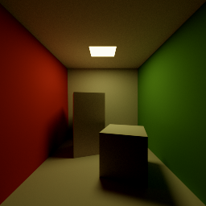{width=50%} | {width=50%} |
|:---------------------------------------------------:|:-----------------------------------------------------:|
| `--max-ray-depth=3`                                 | `--max-ray-depth=8`                                   |

## Minimum ray distance

`--min-ray-dist=<number>`

To prevent self-intersections, rays must have a minimum distance that they will
travel. You can set the distance with this flag. In massive scenes, you may
encounter precision issues if it's too small, and in small scenes, you may see
light leaking a short distance past walls. The default value of 0.0001 is
generally fairly good.

## Acceleration structure strategy

`--as-strategy=<per-material|per-model|static-merged-dynamic-per-model|all-merged>`

This parameter sets how geometry is assigned to BLASes. `per-material` creates
a unique BLAS for every material primitive of each object, and is very
inefficient. `per-model` creates one BLAS per model, which is quite
straightforward.

`static-merged-dynamic-per-model` is the default, which merges all static
(non-animated) meshes into a single BLAS, and creates one BLAS for each dynamic
model. This is a good tradeoff between ray tracing and acceleration structure
building performance.

`all-merged` is the fastest option for offline rendering, as it just dumps all
geometry in one BLAS. It is a bit slow to update though, so this is not
recommended for real-time rendering.

## Shadow mapping

In the `raster` and `dshgi` renderers, shadows are implemented using
[shadow mapping](https://en.wikipedia.org/wiki/Shadow_mapping). There are
multiple parameters controlling them.

### Percentage Closer Filtering

`--pcf=<integer>`

The Percentage Closer Filtering (PCF) technique makes shadows appear smoother.
You can set the number of PCF samples taken. Low values have more noise but are
faster. `--pcf=0` disables PCF and uses bilinear interpolation instead. It's
set to 64 by default, which is pretty slow, but mostly noise-free.
Without [PCSS](#percentage-closer-soft-shadows), PCF uses a constant blur
radius relative to the size of the light source.

Table: Images visualizing the effects of increasing PCF samples.

| PCF        | Image                                   |
|:----------:|:---------------------------------------:|
| `--pcf=0`  | 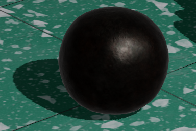{height=6cm}   |
| `--pcf=1`  | 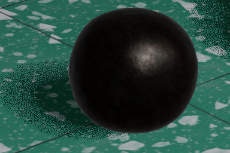{height=6cm}   |
| `--pcf=8`  | {height=6cm}   |
| `--pcf=64` | 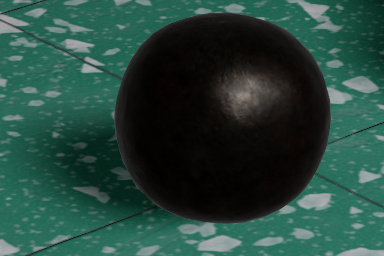{height=6cm} |

### Percentage Closer Soft Shadows

`--pcss=<integer>`

Percentage Closer Soft Shadows (PCSS) works in conjuction with
[Percentage Closer Filtering](#percentage-closer-filtering) in order to create
realistic shadow penumbrae. `--pcss=0` disables it, low values are noisy, the
default is 32. Note that you have to have `--pcf` as something other than 0 for
PCSS to work!

Unfortunately, PCSS only works with directional lights (like the sun), so point
lights do not work. For the table below, the point light in the scene has been
swapped for a directional light.

Table: Images visualizing the effects of increasing PCSS samples.

| PCSS        | Image                                     |
|:-----------:|:-----------------------------------------:|
| `--pcss=0`  | 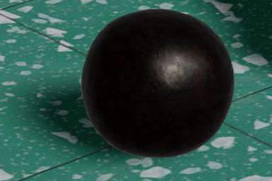{height=6cm}   |
| `--pcss=1`  | 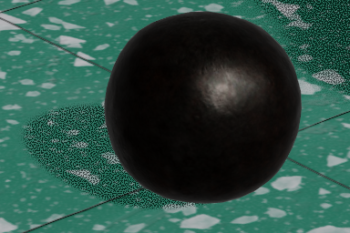{height=6cm}   |
| `--pcss=8`  | 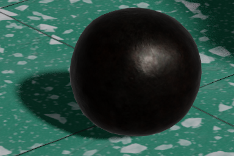{height=6cm}   |
| `--pcss=32` | 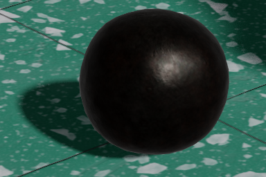{height=6cm} |

If you want to avoid ever going too sharp with the PCSS shadows, you can use
`--pcss-minimum-radius=<number>` to force a minimum radius instead of being
arbitrarily sharp.

### Shadow map bias

`--shadow-map-bias=<number>`

Shadow map biasing is a technique that removes the "shadow acne" artefacts
caused by precision issues. High bias values remove the acne effectively, but
also cause "peter panning", i.e. shadows detached from their casters. The
default is 0.05.

Table: Comparison of a few different bias values. Note how the highest bias
causes notable peter panning (i.e. shadow detached from caster) and the lowest
bias causes "shadow acne."

| PCSS        | Image                                             |
|:-----------:|:-------------------------------------------------:|
| Bias = 0.0  | 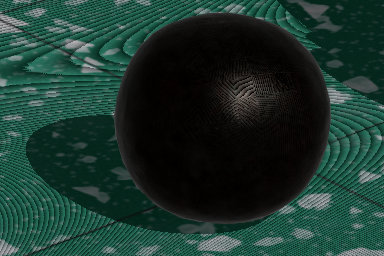{height=6cm}  |
| Bias = 0.05 | 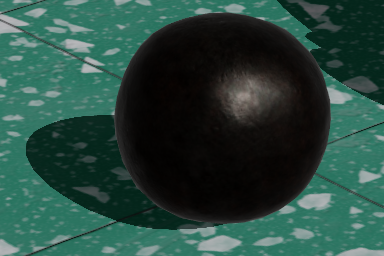{height=6cm}         |
| Bias = 0.5  | 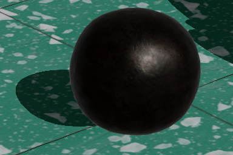{height=6cm} |

### Shadow map cascades

`--shadow-map-cascades=<integer>`

Tauray implement cascaded shadow maps for directional lights. This means that
the same shadow map is rendered at multiple different zoom levels. Nearby areas
are shown with the highest zoom level, while areas further away get successively
less precise shadow maps. This lets the shadow map cover very large distances.

For small scenes, you may want to disable cascades by setting
`--shadow-map-cascades=1`.

### Shadow map depth

`--shadow-map-depth=<number>`

If your scene is very large, the default shadow map distance range of 100 may
not be enough. If you notice that the shadow cuts off, you should increase the
range.

### Shadow map radius

`--shadow-map-radius=<number>`

You usually don't have to change this unless you want to disable shadow map
cascades. If so, you'll have to find a radius that is large enough to cover your
scene. Lower radius values let you distribute the shadow map resolution to a
smaller area, which makes it look more precise.

### Shadow map resolution

`--shadow-map-resolution=<integer>`

In Tauray, shadow maps are simply square images. You can set the size of the
square with this parameter. Higher resolutions allows you to preserve more
details in the shadows, but are also slower to render. Lower resolutions are
also more susceptible to shadow acne.

Table: Effects of resolution to shadow map quality. Bias was manually adjusted
to barely avoid shadow acne in each case.

| Resolution | Image                                      |
|:----------:|:------------------------------------------:|
| 256        | 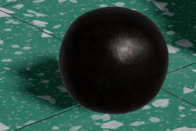{height=6cm}   |
| 1024       | {height=6cm} |
| 4096       | 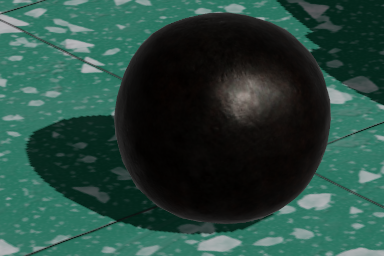{height=6cm} |

## Sampling

### Random number seed

`--rng-seed=<integer>`

Typically, Tauray renders are reproducible in that the RNG seed will always be
the same. If you want to have different noise in the otherwise same render,
you should set the random number generator seed with `--rng-seed`.

### Sampler

`--sampler=<uniform-random|sobol-owen|sobol-z2|sobol-z3>`

A sampler picks the samples for Monte Carlo integration in the path tracer.
`uniform-random` is just regular random values, `sobol-owen` implements
[Practical Hash-based Owen Scrambling](https://jcgt.org/published/0009/04/01/).
`sobol-z2` and `sobol-z3` are related to [Screen-Space Blue-Noise Diffusion of Monte Carlo Sampling Error via Hierarchical Ordering of Pixels](http://abdallagafar.com/publications/zsampler/).
The difference between them is that `sobol-z2` is using a typical 2D Morton curve,
while `sobol-z3` is using a 3D Morton curve where frame index/time is the third axis.

`sobol-z3` is the default, as it seems to perform fairly well in most cases.
For low-spp renders, you may want to go for `sobol-z2` instead. For maximum
performance, `uniform-random` is the fastest.

| 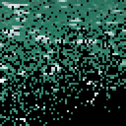{width=20%} | 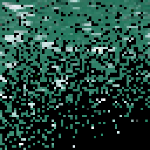{width=20%}         | 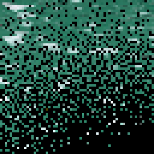{width=20%}             | 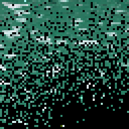{width=20%}             |
|:---------------------------------------------------------------:|:---------------------------------------------------------------:|:---------------------------------------------------------------:|:---------------------------------------------------------------:|
| `uniform-random`                                                | `sobol-owen`                                                    | `sobol-z2`                                                      | `sobol-z3`                                                      |

### Russian roulette sampling

`--russian-roulette=<number>`

Russian Roulette sampling is a method that randomly kills off deep rays in the
scene. It is typically used when you need lots of light bounces, but still
want to render the image reasonably quickly. Higher numbers raise the odds of
rays losing the roulette. You can think of the number as the number of chambers
in the revolver, and only one of them *doesn't* have a bullet...

|                | 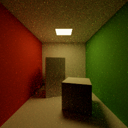    |
|:-----------------------------------------------:|:-----------------------------------------------:|
| 100 bounces, 100k spp, no russian roulette: 22s | Same, but with `--russian-roulette=4` : 3s      |

Note: because this method relies on causing certain samples to have higher
weight than usual, it responds poorly to `--indirect-clamping`!

### BSDF sampling

`--bounce-mode=<hemisphere|cosine|material>`

This parameter selects how path tracer & ReSTIR select the next bounce.
By default, it's set to `material`, which is based on GGX VNDF importance
sampling. `hemisphere` samples direction uniformly from the hemisphere, and
`cosine` samples a cosine hemisphere. The latter two are mostly available for
educational purposes, as they cause significantly increased noise levels.

### Multiple importance sampling (MIS)

`--multiple-importance-sampling=<off|balance|power>`

This parameter sets the MIS type for the path tracer. It's set to `power` by
default, as it's usually the lowest-noise approach. Disabling MIS is also
possible with `off`, but that's mostly useful for educational purposes, as the
image will be full of fireflies for any non-trivial scene.

Note that ReSTIR always uses the balance heuristic regardless of this setting.

### Point lights

`--sample-point-lights=<float>` can be used to set the relative weight
of sampling point lights in next event estimation. Higher values emphasize
point lights more than other light types. 0 disables next event estimation
of point lights.

### Directional lights

`--sample-directional=<float>` can be used to set the relative weight
of sampling directional lights in next event estimation. Higher values emphasize
directional lights more than other light types. 0 disables next event estimation
of directional lights.

### Environment maps / infinite area lights

`--sample-envmap=<float>` can be used to set the relative weight
of sampling directions from the environment map in next event estimation.
Higher values emphasize envmaps over other light types.
0 disables next event estimation of envmaps. Envmap sampling is implemented via
alias tables, so it's O(1) regardless of the environment map resolution.

### Triangle area lights

`--sample-emissive-triangles=<float>` can be used to set the relative weight
of sampling emissive triangles in next event estimation. Higher values emphasize
triangle lights more than other light types. 0 disables next event estimation
of emissive triangles.

`--tri-light-mode=<area|solid-angle|hybrid>` controls how triangular area lights
are sampled. The `area` method is robust, but noisy. `solid-angle` has less
noise, but is also less robust to very small triangles. `hybrid` should be
robust and low-noise, but it is also slower.

### Samples per pixel

`--samples-per-pixel=<integer>`

This flag has two meanings depending on the renderer, but they are both somewhat
related. For rasterization-based renderers (such as `raster` and `dshgi`),
it's the number of [anti-aliasing](#anti-aliasing) samples to take per pixel.

For path tracing, it's the number of Monte Carlo samples to take. Lower numbers
are fast, but noisy. High numbers are slow, but don't have much noise.

Usually, `--samples-per-pixel=4096` is suitable for offline rendering with path
tracing. The default value is 1, which is suitable real-time use in all
contexts.

Table: Effects of samples per pixel (SPP) counts to noise in path tracing.

| 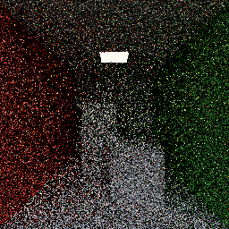{width=12%}       | 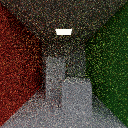{width=12%}       | 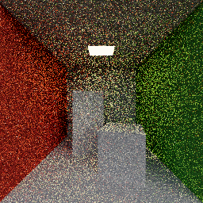{width=12%}     | {width=12%}     | 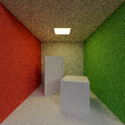{width=12%}   | 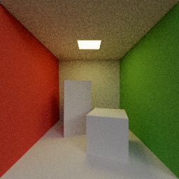{width=12%} | {width=12%} |
|:-------------------------------------:|:-------------------------------------:|:-------------------------------------:|:-------------------------------------:|:-------------------------------------:|:-------------------------------------:|:-------------------------------------:|
|            1 SPP                      |            4 SPP                      |            16 SPP                     |            64 SPP                     |            256 SPP                    |            1024 SPP                   |            4096 SPP                   |

For performance, you may consider setting `--samples-per-pass=8` or so. This
parameter makes one shader pass calculate more samples, reducing overall
overhead. However, too high values can cause driver timeouts, as their watchdogs
bite Tauray if it takes too many seconds to run one pass.

## DDISH-GI

Many parameters affect DDISH-GI (`--renderer=dshgi`) alone.

### Temporal reuse

`--dshgi-temporal-ratio=<number>`

To adjust the temporal reuse, which affects visible flickering in probe data,
you can use the `--dshgi-temporal-ratio` parameter. The argument is between
0 and 1, where 1 means all data comes from the current frame and values
approaching zero use increasingly more data from previous frames.

### Samples per probe

`--samples-per-probe=<integer>`

This parameter adjusts how many paths are traced per probe during each frame.
Higher values make the update slower, but reduce flickering.

### Spherical harmonics order

`--sh-order=<integer>`

By default, spherical harmonics up to L2 are used for the probe data. You can
select orders between 1 and 4. Higher orders store more detailed information,
which can be visible in reflections, but are increasingly slower.

| 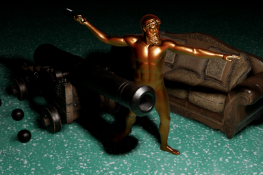{width=50%} | 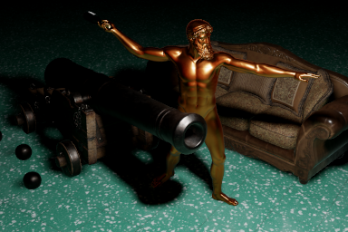{width=50%} |
|:------------------------------------------------------:|:------------------------------------------------------:|
| DDISH-GI with `--sh-order=2`.                          | Same, but with `--sh-order=4`.                         |

### Probe visibility approximation

`--use-probe-visibility=<on|off>`

This flag can reduce light leaking from probes, but can also cause odd artefacts
and slow down rendering significantly. It's disabled by default.

|  | 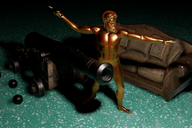    |
|:-------------------------------------------:|:-------------------------------------------:|
| DDISH-GI with `--use-probe-visibility=off`. | Same, but with `--use-probe-visibility=on`. |

## Reprojection

Reprojection can be used with path tracing to re-use data from previous frames
or other viewports. These are the *temporal* and *spatial* reprojection,
respectively.

### Spatial reprojection

`--spatial-reprojection=<int,int,...>`

This type of reprojection is only useful for light-field rendering. You list the
viewport indices that are rendered, and the rest are then reprojected from
those.

### Temporal reprojection

`--temporal-reprojection=<number>`

Temporal reprojection can be used with regular renders as well, though it's
most useful in [interactive mode](#interactive-rendering). This method re-uses
pixel values from the previous frame to deliver a more noise-free image.
The given number affects the ratio of data re-used from the previous frame,
where 0 is no re-use and 0.5 is 50/50 new and old frame.

## Accumulation

`--accumulation=<on|off>`

Enables accumulation in the interactive path tracer, meaning that new frames
are blended with previous frames until you move. This lets you quickly and
interactively preview scenes with high SPP counts, as you can fly around
normally, then stop to accumulate a high-SPP image. Do not use accumulation in
headless mode.

## Transparent background

`--transparent-background=<on|off>`

If you want to render cut-out images where the background is transparent, you
can use `--transparent-background` to achieve just that.

## Depth of field

`--depth-of-field=<f-stop,distance,sensor-size,sides,angle>`.

You can enable simulation of a simplistic non-pinhole camera with the
thin-lens model, by using the `--depth-of-field` option. `f-stop` controls
the [aperture size](https://en.wikipedia.org/wiki/F-number), `distance` sets
the distance to the plane of focus, `sensor-size` sets the camera sensor size
(default: 0.036), `sides` sets the shape of the aperture (0 = circle, 3 and
above: polygonal), `angle` sets the angle of a polygonal aperture.


## Force white albedo for first bounce

`--use-white-albedo-on-first-bounce=<on|off>`

This flag has a very specific use case in mind: denoising research. You can
force the albedo of every material to be white on the first intersection, which
lets you observe the lighting arriving at the surface without meddling
textures. On further bounces, the materials are back to their usual colors, so
you still get color bleeding!


## Up axis

`--up-axis=<x|y|z>`

This rotates the scene such that the given axis points up. By default, the
Y-axis points up.

# Limitations

There are things that Tauray does not handle well. In such cases, you may want
to use some other tool instead. This list of limitations may also change in the
future, as we work on implementing more missing features. Namely:

* Poor sampling of non-spherical area lights (i.e. emissive volumes). There is
  no importance sampling for these yet, so the image will be pretty noisy.
* Morph target animations are not supported.
* Advanced material models are not yet supported, only the basic GGX
  metallic-roughness + transmission.
* Noisy caustics, due to the forward path tracing algorithm.

# Conclusion

Thank you for using Tauray.
